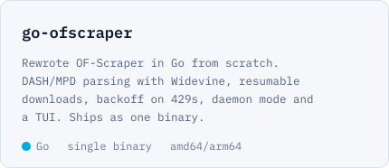
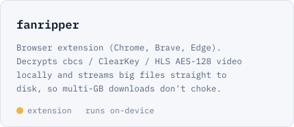

<picture>
  <source media="(prefers-color-scheme: dark)" srcset="assets/hero-dark.svg" />
  
</picture>

I spend most of my time taking apart obfuscated JS and working out how sites fingerprint browsers and requests. The rest of the time I build websites and backends.

### what I work on

- **JS deobfuscation**: AST transforms, string array decoding, unflattening control flow
- **browser fingerprinting**: canvas, WebGL, audio, navigator, anti-bot sensor payloads
- **request fingerprinting**: TLS (JA3/JA4), HTTP/2 settings and frame order, header order
- **full stack**: websites, APIs, backends

### stack

**languages:** Go, Rust, TypeScript, JavaScript, Python 
**web:** Node, React, Next.js, Astro, Docker 
**reversing:** Chrome DevTools, Babel, Wireshark, mitmproxy

### projects

<a href="https://github.com/SatyamHitman/go-ofscraper"><picture><source media="(prefers-color-scheme: dark)" srcset="assets/project-go-ofscraper-dark.svg" /></picture></a>
<a href="https://github.com/SatyamHitman/fanripper"><picture><source media="(prefers-color-scheme: dark)" srcset="assets/project-fanripper-dark.svg" /></picture></a>
